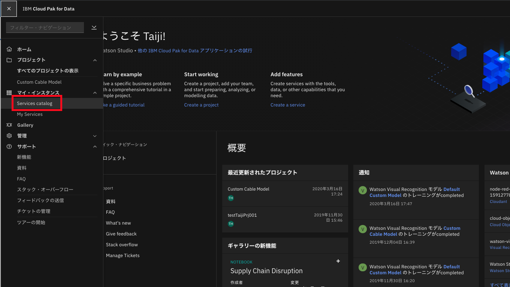

# IBM Cloud FunctionsとWatson Visual Recognitionを使ってbox上の画像を自動仕分けする

ここで作成するのは、サーバーレスサービス「IBM Cloud Functions」、AIサービス「Watson」の画像認識機能「Visual Recognition」、ファイル共有サービス「box」を組み合わせて、ケーブル画像を適切なフォルダーに仕分けするサービスです。

# IBMが提供するAI Watson

AI（Augmented Intelligence）サービス「Watson」の中で最も人気があるものの一つが、画像認識機能「Visual Recognition」です。
Watsonが既に学習を済ませているので、すぐに画像や映像に写った複数の物体、情景を分析・認識できます。
このほか、機械学習によりWatsonに独自の画像データを学習させることも可能です。
Visual Recognitionを各種サービスへ組み込むときのインタフェースとして、REST形式のAPIが提供されています。
また、Visual Recognitionの設定ツールも用意しています。
この設定ツールを利用することで、複雑なコードを書くことなく、簡単に独自の画像認識サービスを実現できます。
既に、自社製品の認識・分類、製造ラインにおける欠陥検出といった多種多様な業務で、少ない画像枚数による短時間の機械学習で高い精度の画像認識を実現しています。
<br>
ここでは、サーバーレスサービス「IBM Cloud Functions」およびファイル共有サービスである「Box」と組み合わせて、Boxへアップロードされたケーブルの画像を自動で仕分けするサービスを作成します。


<p align="center">
  
</p>

## アプリの処理の流れ

1. ユーザーがboxにファイルをアップロードする
2. アップロードされたことをWebhookで通知する
3. ファイルの画像イメージをVisual Recognitionへ渡す
4. Visual Recognitionが分類結果を返す
5. 分類結果からファイルを適切なフォルダーに移動する

## 開発のステップ

1. Visual Recognitionサービスの作成
2. Visual Recognitionの学習
3. Boxアプリの作成
4. サーバーレスアプリの作成
5. Webhookの設定


# 事前準備

* [IBM Cloudアカウント](https://ibm.biz/BdzKBB): IBMが提供するクラウドサービス及びクラウドプラットフォーム
* [Watson Visual Recognition](https://www.ibm.com/jp-ja/cloud/watson-visual-recognition): IBM Watsonによる画像解析エンジン及びAPI
* [IBM Cloud CLI](https://www.ibm.com/jp-ja/cloud/cli): IBM Cloudを操作するためのコマンドラインツール
* [Boxアカウント](https://www.box.com/ja-jp/pricing/individual)


# 開発

## IBM Cloudアカウント作成とログイン

1. [こちら](https://ibm.biz/BdzKBB)へアクセスしてIBM Cloudのアカウントを作成します。既にアカウントをお持ちの方は、そのままログインして下さい。<br>
* アカウント作成にはメールアドレスとご自身で設定するパスワードが必要です。今回作成するアカウントは無料で使える**ライトアカウント**ですのでクレジットカードは不要です。

## CLIツールのインストール

1. [IBM Cloud Functionsのダッシュボード画面](https://cloud.ibm.com/functions)の左にある「CLI」メニュー、または中央の「CLIのダウンロード」ボタンをクリックします。<br>
2. 表示された「1.ダウンロード」の手順で、使用しているパソコンのOSに合わせてIBM Cloud CLIのインストーラーを入手してインストールします。
3. 端末（シェル）またはPowerShellを開いて「2」と「3」の指示通りにコマンドを実行します。
4. 「4」まで動作したらOKです。

<p align="center">
  
</p>

## サンプルソースコード・画像ファイルの取得

事前に用意したサンプルのソースコードや画像ファイルを入手します。
以降に説明するサービスの作成は、これらのファイルを使いながら説明します。
1. このリポジトリをCloneするかダウンロードして展開して下さい。
以下のようにディレクトリーが配置されます。

<p align="center">
  
</p>

## boxアカウントの作成

1. [boxの公式サイト](https://www.box.com/ja-jp/pricing/individual)に アクセスし、無料の個人ユーザーアカウントを取得してください。
アカウントを取得してログインしたら、画像仕分けサービスで利用するフォルダーを作成します。

2. 右上の「新規作成」メニューから「フォルダ」を選択します。
3. 任意のフォルダー名を入力して「作成」をクリックします。

<p align="center">
  
</p>

4. 同様の手順で、この中に画像ファイルを仕分けするためのフォルダーを作成します。ここでは画像の種類に合わせて「hdmi_male」「thunderbolt_male」「usb_male」「vga_male」のフォルダーを作ります。

<p align="center">
  
</p>

5. boxアカウントの2段階認証を有効にします。右上のアカウントアイコンをクリックし、「アカウント設定」を選択します。アカウント設定画面が表示されたらスクロールして認証項目の「未承認のログインに対しては2段階認証を必須にする」にチェックを付けます。

<p align="center">
  
</p>

6. 設定画面が表示されたら、「日本（+81）」を選んで確認コードを送信する電話番号を入力して「続行」ボタンをクリックします。入力した電話番号宛てにSMSで送られてきたコードを入力して「続行」ボタンをクリックします。コードは2種類入力します。
7. 最後に、画面右上の「変更を保存」ボタンをクリックします。

## Visual Recognitionサービスの作成

1. IBM Cloudにログイン後、ダッシュボード画面上部の「カタログ」をクリックします。
2. 画面左部分のカテゴリーから「AI」をクリックし、Watsonサービス群を表示します。この中から「Watson Studio」をクリックします。「サービス名」は任意に設定できます。そのままで構わないので「作成」ボタンをクリックします。

<p align="center">
  
  
</p>
3. Visual Recognitionの学習ではカスタム画像処理を行うために、Visual Recognitionで画像データの学習を実施します。まずは「Get Started」をクリックします。別のタブに設定ツール「Watson Studio」の画面が開きます。


## Watson Studioで機械学習
1. 左上のハンバーガー（3本線）メニューから「Services」-「Watson Services」を選び、「Add Service」ボタンをクリックします。

<p align="center">
  
</p>

2. 並んでいるパネルから「Visual Recognition」を選択してください。「Lite」プランが選択されていることを確認し、「Create」ボタンをクリックします。「Confirm Creation」の画面が表示されるので内容を確認し、「Confirm」ボタンをクリックしてサービスを作成します。

<p align="center">
  
</p>

3. サービス一覧画面にVisual Recognitionの項目が現れるので、その項目にある「Launch Tool」ボタンをクリックします。

<p align="center">
  
</p>

4. カスタム画像認識処理用のカスタムモデルを作成するため、「Classify Images」カ テ ゴ リ ー の「Create Model」ボ タ ン を ク リ ッ ク し ま す。名前に「Custom Cable Model」を入力し、「Create」ボタンをクリックします。

<p align="center">
  
  
</p>

5. カスタムモデルを作成するための画面が表示されます。学習させる画像は「0_Watson」フォルダー内の「Training_Data」フォルダーにあります。
ケーブルの種類別 に「hdmi_male.zip」「thunderbolt_male.zip」「usb_male.zip」「vga_male.zip」の画像ファイル群を用意しています。

<p align="center">
  
</p>

6. 分類する画像の種類を「クラス」と呼び、このクラスごとにZIP形式で画像をまとめて配置します。Training Dataフォルダー内にあるサンプル画像の各ZIPファイルをデータパネルにアップロードします。右の「Browse」ボタンをクリックしてファイルを選択するか、あるいは「To add files to ...」にドラッグ＆ドロップでアップロードし、四つのZIPファイルをモデルに追加します。

<p align="center">
  
</p>

7. ファイルがアップロードされると、自動で画像がモデルとして読み込まれます。自動で読み込まれない場合は、各ファイルにチェックを付けて「Add to model」をクリックします。「Train Model」ボタンがアクティブになったら、そのボタンをクリックします。しばらく待ち、学習が完了したという通知が表示されれば完了です。

<p align="center">
  
</p>

## 画像分類のテスト

では学習結果をテストしてみましょう。
1. カスタムモデルの概要が表示されたら、「Test」タブをクリックしてテスト画面を表示します。
2. サンプルの「0.Watson」フォルダー内の「Test Data」フォルダーにある四つの画像ファイルを、「Drop image files ...」と書かれた箇所にドラック＆ドロップすると、画像の下部にテスト結果がスコアで表示されます。

## Watson Visual Recognition API資格情報の取得

Visual Recognitionの機能をIBM Cloud Functionsのコードから呼び出すための資格情報（Custom Model IDとAPIキー）を確認します。
1. Custom Model IDを確認します。「Overview」タブをクリックしてカスタムモデルの概要ページを表示します。「Summary」ペインの「Model ID」をコピーします。
2. 次に、Visual RecognitionのAPIキーを確認します。上部の「Associated Service」にあるリンクをクリックして「Visual Recognition」のサービスインスタンス画面に移動します。「Credentials」タ ブ を ク リ ッ ク し、「Auto-generated service credentials」にある「View credentials」をクリックして資格情報を表示します。資格情報のページで「api_key」（APIキー）をコピーします。
3. サンプルの中にある「vr.json」を編集し、「apikey」と「classifier_id」の右辺の「"」内に、コピーしたAPIキーとModel IDを記入します。
```
{
    "apikey": "",           // APIキーを入力 
    "classifier_id": ""     // Model IDを入力
}
```

## boxアプリの作成

ここからは、boxサービスにてファイルをアップロードしたことをWebhookで通知するための設定をします。

1. [boxコンソール画面](https://app.box.com/developers/console)にアクセスし、「アプリの新規作成」ボタンをクリックします。「カスタムアプリ」を選んで「次へ」ボタンをクリックします。
2. 「JWTを使用したOAuth2.0（サーバー認証）」を選択して「次へ」ボタンをクリックします。
3. 「アプリに一意の名前を付けます」に任意のアプリ名を入力し、「アプリの作成」ボタンをクリックします。ここでは「WatsonDiscoveryApp」としました。作成完了画面で「アプリの表示」ボタンをクリックして詳細設定画面を表示します。

<p align="center">
  
</p>

## boxアプリの設定

1. boxアプリの設定を次のように変更します。
* 「アプリケーションアクセス」を「Enterprise」にします。
* 「アプリケーションスコープ」で「Webhookを管理」にチェックを付けます。
* 「高度な機能」にある二つの項目を有効にします。

<p align="center">
  
</p>

2. 変更したら、右上の「変更を保存」ボタンをクリックします。
3. アプリのJWTリクエストに対する認証キーを生成します。「公開/秘密キーペアを生成」ボタンをクリックして認証後にキーが生成され、JSON形式のファイルとしてダウンロードできます。そのファイル名を「box.json」に変更し、リポジトリフォルダーの直下に配置します。
4. さらに「2_box-watson-classify」と「3_box-file-move」のフォルダーの下にもbox.jsonファイルをコピーして配置します。

<p align="center">
  
</p>

5. box開発者コンソールでアプリを認証するためのクライアントIDを確認します。同じ画面の「OAuth2.0資格情報」の「クライアントID」をコピーします。
6. [https://app.box.com/master](https://app.box.com/master)にアクセスし、管理コンソールを表示します。左メニューの「Enterprise設定」をクリックし、「アプリ」タブをクリックします。下へスクロールして「新しいアプリケーションを承認」ボタンをクリックします。
7. 「APIキー」にコピーしたクライアントIDを入力し、「次へ」ボタンをクリックし、確認画面で「承認」をクリックします。

## サーバーレスアプリの作成
ここでは、アップロードしたファイルをVisual Recognitionに渡して画像クラスを取得し、移動先のフォルダーのIDを判定する「box-watson-classify」アクション、box-watson-classifyアクションからフォルダー IDを取得してファイルを移動する「box-file-move」アクション、二つのアクションを接続する「box-watson-app」アクションという3種類のアクションを作成します。

1. box-watson-classifyアクションの作成
box-watson-classifyアクションを作成するためのソースコードは、「2_box-watson-classify」フォルダー内に収めています。IBM Cloud Functions CLIから次のコマンドを実行してアクションを作成します。
    * 2_box-watson-classifyフォルダーに移動します。
    * すべての依存関係があるパッケージをインストールした上で、action.zipにまとめます。
    * 最後のコマンドでアクションを生成します。

    「ok:  created action box-watson-classify」と表示されれば作成完了です。

```
$ cd IBMCloud_SampleApp
$ cd 2_box-watson-classify$ npm install
$ zip -r action.zip *
$ ibmcloud wsk action create box-watson-classify \
>    --kind nodejs:8 action.zip \
>    --param-file ../vr.json
```

2. box-file-moveアクションの作成
 box-file-moveアクションを作成する手順もほぼ同様です。ソースコードは「3_box-file-move」フォルダー内に収めています。IBM Cloud Functions CLIから次のコマンド実行してアクションを作成します。
 こちらも「ok:  created action box-file-move」と表示されれば作成完了です。 

```
$ cd 3_box-file-move
$ npm install
$ zip -r action.zip *
$ ibmcloud wsk action create box-file-move \
>    --kind nodejs:8 action.zip
```

3. box-watson-appアクションの作成
二つのアクションを作成したら、それをつなぐためのbox-watson-appアクションを次のコマンドで作成します。「ok:  created action box-watson-app」と表示されれば作成完了です。

```
$ ibmcloud wsk action create box-watson-app \
>    --sequence box-watson-classify,box-file-move \
>    --web true
```

## Webhookの設定
作業用のboxフォルダーにファイルがアップロードされたときにWebhookが呼ばれるようにBoxを設定します。

1. サンプルの「1_Webhook」フォルダーにある「setWebhook.js」ファイルを編集し、必要な資格情報を入力します。入力する情報としては「BoxのユーザーID」「Boxのフォルダー ID」「Webhookの送り先URL」です。
2. [Box開発者コンソール](https://app.box.com/developers/console/)を開いて、先ほど作成したboxアプリ名をクリックします。「一般」の「アプリ情報」に「ユーザーID」があります。これがBoxのユーザーIDです。Boxアカウント登録時に作成した、Boxのフォルダーを開きます。URLの末尾の数字がフォルダーIDです。
3. [IBM Cloud Functionsのアクション一覧画面](https://cloud.ibm.com/functions/actions)から「box-watson-app」をクリックします。左側メニューの「エンドポイント」を選びます。「Webアクション」の「パブリック」が送り先のURLになります。それぞれコピーしたら、setWebhook.jsファイルをエディタで開き、次のように記入して保存します。

```
/* Boxの自分のユーザー IDを入力 */
var userID = '';    //Boxのユーザー IDを入力

/* 今回利用するBoxのフォルダー IDを入力 */
var parentFolderID = '';    //Boxのフォルダー IDを入力

/* Webhookの送り先のURLを入力 */
var webhookurl = '';    //Webhookの送り先URLを入力
```

4. 書き換えが完了したら、次のコマンドでプログラムを実行します。このプログラムは、ローカル上で動作しています。

```
$ cd IBMCloud_SampleApp/1_Webhook
$ npm install --save box-node-sdk
$ node setWebhook.js
```

以上でアプリが完成しました。0_Watsonフォルダーの「Test_Data」フォルダーに動作確認用のファイルがあるのでそれを使って動作確認してみましょう。box APIであれば、PDFファイルからサムネイルの画像イメージを取得することも可能です。


# Links
[IBM Cloudダッシュボード](https://ibm.biz/BdzKBB)

# Learn more

[Functionsを使ったiOSアプリケーションの作成](http://ibm.biz/functions-iosapp01)

[Knativeとは何か](https://developer.ibm.com/jp/new-builders/knative/)

[Knativeチュートリアル](http://ibm.biz/knative-tut-01)


# License

[Apache 2.0](LICENSE)
